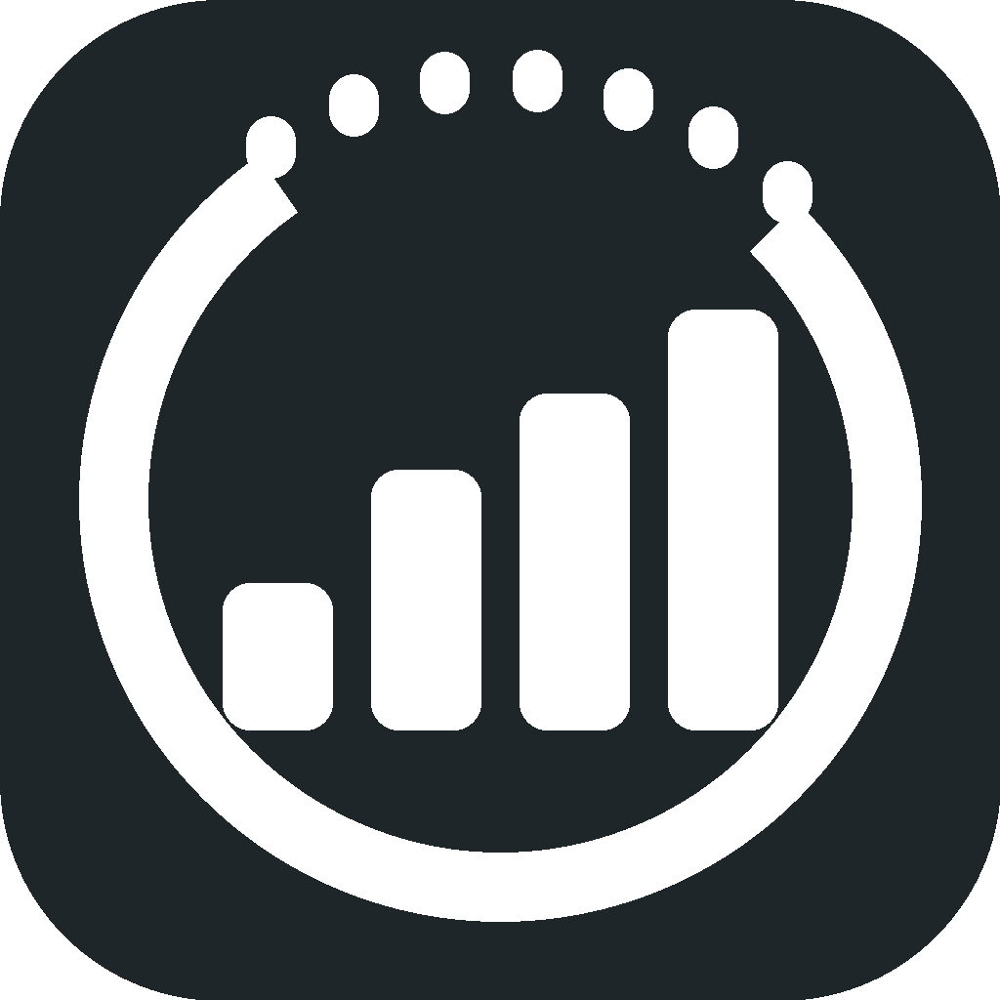
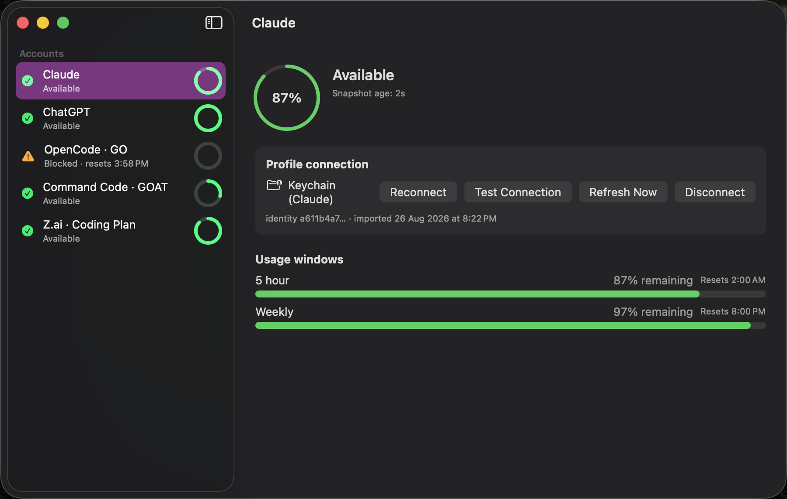
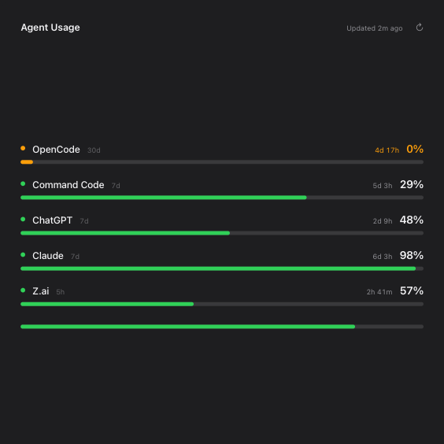

<div align="center">



# Agent Usage

**A native macOS dashboard & widgets for your AI coding subscriptions.**

Stop guessing how much quota you have left. Agent Usage tracks your
Claude, ChatGPT, OpenCode, Command Code and Z.ai limits in one place —
with Desktop widgets that stay fresh on their own.

[](https://github.com/juanlatorre/agent-usage-widget/releases/latest)
[](https://github.com/juanlatorre/agent-usage-widget/releases/latest)
[](LICENSE)
[](Packages/AgentUsageCore)

[Download](#-install) · [Build from source](#-build-from-source) · [How it works](#-how-it-works)





</div>

---

## ✨ Features

- **All your AI subscriptions, one glance** — Claude, ChatGPT, OpenCode · GO, Command Code · GOAT and Z.ai · Coding Plan, side by side.
- **Three Desktop widgets** — Small (one account), Medium (up to three), Large (all your accounts) with usage bars, reset countdowns (`5d 3h`, `2h 41m`) and one-tap refresh.
- **Always fresh, even when you're not looking** — closing the window doesn't quit the app, and it registers itself as a login item by default (opt out any time), so widgets stay inside the freshness horizon across reboots.
- **Honest states, always** — Available / Blocked / rate-limited / stale data are derived from real snapshots. No fabricated 0%, no fake freshness: stale data shows dimmed bars with its age instead of pretending to be current.
- **Auto-refresh that respects providers** — honors server `Retry-After` verbatim, backs off across relaunches, recovers on its own when a rate-limit window expires.
- **Keychain-native credentials** — API keys live in the macOS Keychain, never in plain files. Claude and Codex can reuse the CLI's own login.
- **Zero telemetry** — no analytics, no servers of ours. Usage numbers come straight from each provider's official endpoints to your Mac.

## 📊 Supported providers

| Provider | Windows tracked | Auth |
| --- | --- | --- |
| Claude | 5-hour · 7-day | OAuth (Keychain or `~/.claude`) |
| ChatGPT / Codex | 5-hour · weekly | OAuth from `~/.codex` |
| OpenCode · GO | 5-hour · weekly · monthly | API key or `auth.json` |
| Command Code · GOAT | 5-hour · weekly | API key |
| Z.ai Coding Plan | 5-hour | API key |

## 📥 Install

1. Grab the latest **`AgentUsage-<version>-arm64.dmg`** from [Releases](https://github.com/juanlatorre/agent-usage-widget/releases/latest).
2. Open it and drag **Agent Usage** to `Applications`.
3. Double-click to launch — Developer ID signed and **notarized**, opens with no warnings.

> Requires macOS 14+ on Apple Silicon.

Then: pick an account, connect it (paste a key or point it at your CLI config), and add the widget from your Desktop's widget gallery.

## 🛠 Build from source

```bash
git clone https://github.com/juanlatorre/agent-usage-widget.git
cd agent-usage-widget
open App/AgentUsage.xcodeproj   # select the AgentUsage scheme, ⌘R
```

The core logic lives in `Packages/AgentUsageCore` and is fully self-contained:

```bash
swift test --package-path Packages/AgentUsageCore   # 233 tests
```

## 🧠 How it works

- **`AgentUsageCore`** — one Swift package with everything: per-provider transports, credential stores, and the **AvailabilityEngine**, a pure function that derives every UI state from snapshot data + freshness. App and widgets share it, so they can never disagree.
- **Snapshot store** — every successful fetch is persisted atomically per slot and mirrored to the locations the widgets can read, so widgets keep working with the app closed.
- **Refresh pipeline** — a scheduler with single-flight coalescing, bounded concurrency, server-directed backoff (`Retry-After` is law) and reset-boundary triggers; a 30-second recovery timer picks up due slots while the app is open.
- **Self-healing credentials** — pasted keys are sanitized (JSON blobs, `Bearer` prefixes, stray quotes), stored blobs from older versions are healed in place, and an expired Claude token is re-imported from the CLI automatically.

## 🔒 Privacy

Credentials live in the login Keychain. Usage snapshots and preferences are plain local JSON. Nothing leaves your Mac except the read-only calls to each provider's billing/usage endpoint. That's the whole story.

## 📄 License

[MIT](LICENSE) © Juan Latorre

<div align="center">
<sub>Built with Swift, SwiftUI & WidgetKit.</sub><br/>
<sub>⭐ If it saves you a blocked session, star it.</sub>
</div>
